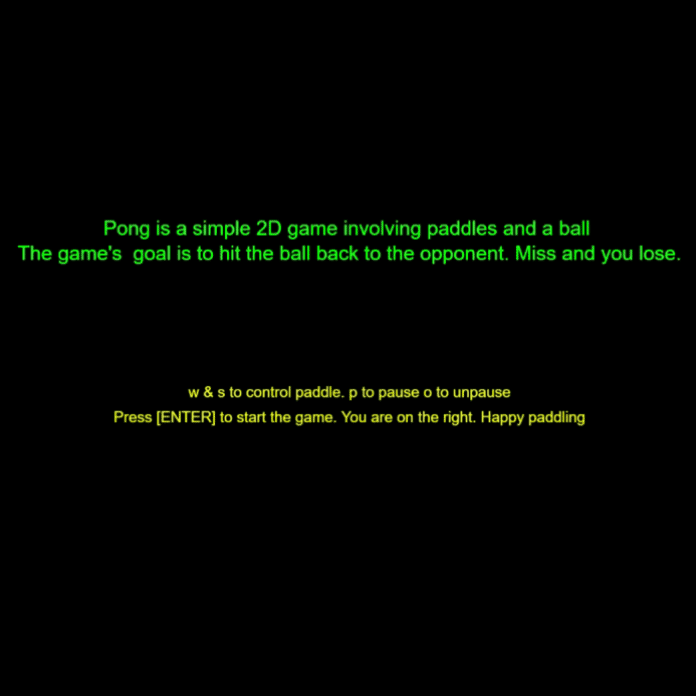

# Pong-p5js                                                                                                     
Pong written in javascript and p5.js

p5.js is a javascript library that allows programmers to do something callled "Sketching" or "drawing in code".

[Play the game here](https://pong-p5js.netlify.com/)

## Building
* run "npm install" to download all dependencies - we only need browserify to package all the code into bundle.js
* run "npm run build" 
* open index.html in browser

## Pong in action

## References

[p5.js](https://p5js.org/reference/)
